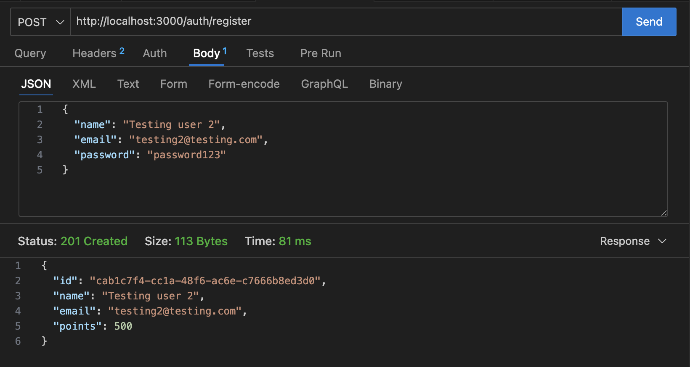
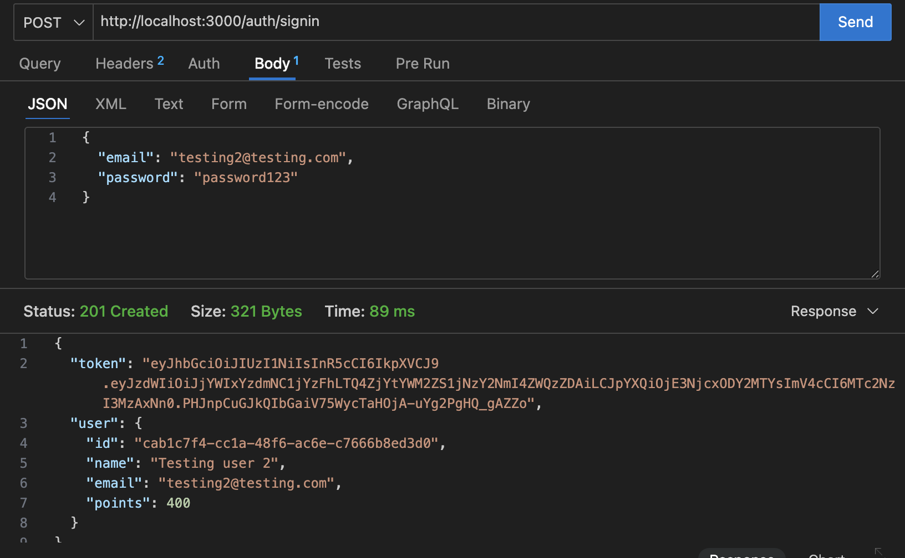
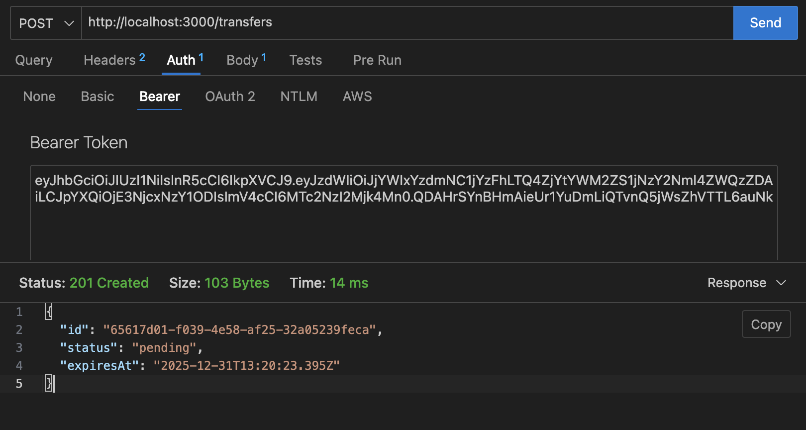
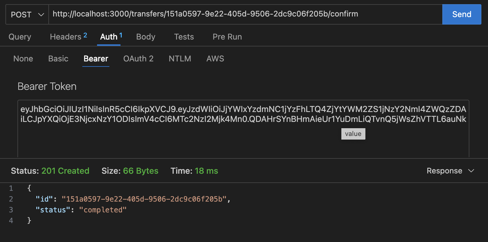
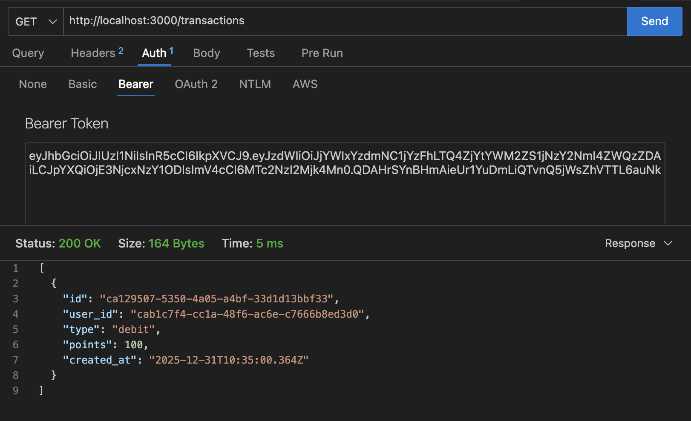

# Points Transfer API

A minimal NestJS backend that allows users to transfer loyalty points between each other with safe, transactional handling using PostgreSQL.

## How It Works

1. **Register User** → New user is created with 500 initial points.
2. **Login** → User signs in and receives a JWT token.
3. **Create Transfer** → User creates a transfer request to another user (by email). Transfer is saved as PENDING with a 10-minute expiry.
4. **Confirm Transfer** → On confirmation:
   * Sender balance is locked
   * Points are deducted from sender
   * Points are added to receiver
   * Debit & credit transactions are recorded
   * Transfer is marked COMPLETED
5. **View Transactions** → User can view their complete transaction history.

## Flow Diagram

```
Register → Login → Create Transfer → Confirm Transfer
              ↓
      DB Transaction (BEGIN)
              ↓
      Lock Sender Wallet
              ↓
   Deduct Sender / Add Receiver
              ↓
   Insert Debit & Credit Records
              ↓
        COMMIT
```
## Key Features

- **In-Memory Storage**: All data stored in arrays (users, transfers, transactions)
- **JWT Authentication**: Token-based auth for secure endpoints
- **Password Hashing**: bcrypt for secure password storage
- **Transfer Expiry**: Unconfirmed transfers expire after 10 minutes
- **Concurrent Protection**: Lock mechanism prevents two transfers from the same user happening simultaneously.

## Database Tables

* **users** – user info and point balance
* **transfers** – pending / completed transfers
* **transactions** – debit & credit history

## API Endpoints

| Method | Endpoint | Description |
|--------|----------|-------------|
| POST | `/auth/register` | Register new user |
| POST | `/auth/login` | Login and get JWT |
| POST | `/transfers` | Create transfer |
| POST | `/transfers/:id/confirm` | Confirm transfer |
| GET | `/transactions` | View transaction history |

## Run Locally

```bash
npm install
npm run start:dev
```

Server runs at `http://localhost:3000`


## API Testing Screenshots

### User Registration


### Login


### Create Transfer


### Confirm Transfer


### Transaction History

